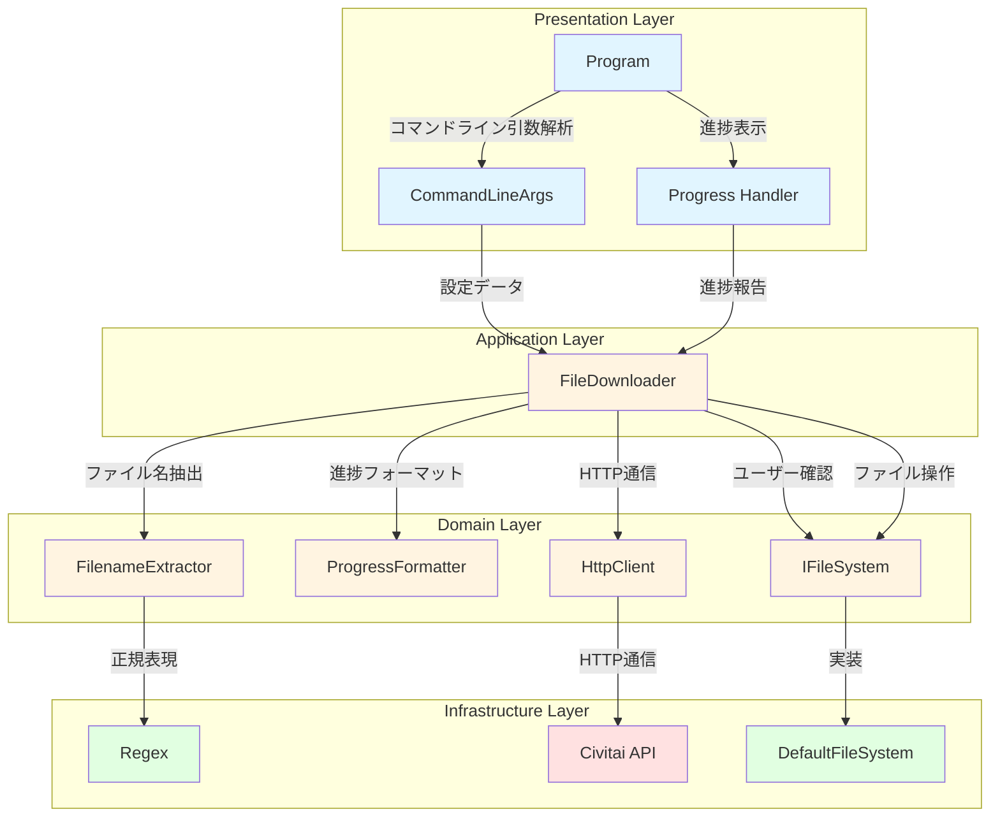
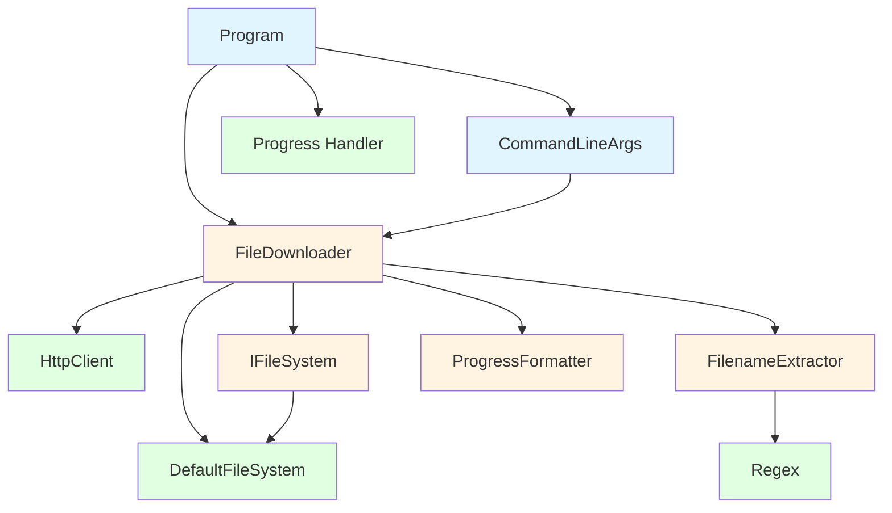

# アーキテクチャと責務マップ

## 全体アーキテクチャ

## クラスの責務マップ

| クラス名 | 責務 | 主要メソッド/プロパティ | 依存関係 |
|---------|------|------------------------|----------|
| **Program** | エントリーポイント、CLI UI、主要な制御フロー | `Main()`, `PrintUsage()` | CommandLineArgs, FileDownloader |
| **CommandLineArgs** | コマンドライン引数の解析と保持 | `Parse()`, `Url`, `OutputDirectory`, `Filename`, `Token`, `AutoOverwrite`, `ShowHelp` | なし |
| **FileDownloader** | ファイルダウンロードの主要ロジック、抽出とフォーマットの委譲 | `DownloadFileAsync()`, `AddTokenToUrl()`, `FormatBytes()`, `GenerateProgressBar()` | HttpClient, IFileSystem, FilenameExtractor, ProgressFormatter |
| **FilenameExtractor** | ファイル名抽出（Content-Disposition/URL） | `ExtractFilenameFromContentDisposition()`, `ExtractFilenameFromUrl()` | Regex |
| **ProgressFormatter** | 進捗表示フォーマット（バイト数/バー） | `FormatBytes()`, `GenerateProgressBar()` | なし |
| **IFileSystem** | ファイルシステム操作の抽象化（テスト容易性向上） | `FileExists()`, `DeleteFile()`, `ReadKey()` | なし |
| **DefaultFileSystem** | IFileSystem の実装（実際のファイルシステム操作） | `FileExists()`, `DeleteFile()`, `ReadKey()` | System.IO, System |
| **TestConstants** | テストで使用する定数（短時間/長時間リンク） | `CivitaiDownloadUrl_Short`, `ExpectedFilename_Short`, `CivitaiDownloadUrl_Long`, `ExpectedFilename_Long` | なし |

## モジュール間の依存関係

## 各クラスの詳細説明

### Program
- **役割**: アプリケーションのエントリーポイント
- **主な処理**:
  1. コマンドライン引数の解析
  2. 出力ディレクトリの確認と作成
  3. FileDownloader を使用してファイルをダウンロード
  4. 進捗を表示
  5. 結果をコンソールに出力
  6. エラー発生時の処理

### CommandLineArgs
- **役割**: コマンドライン引数の解析と保持
- **主な処理**:
   1. `--url`, `--output`, `--filename`, `-y`, `--token`, `-h`, `--help` を解析
  2. 環境変数 `CIVITAI_API_KEY` から token を取得
  3. 位置パラメータ（URL）を解析

### FileDownloader
- **役割**: ファイルダウンロードの主要ロジックを実行（他のクラスに責務を委譲）
- **主な処理**:
  1. HTTP リクエストを送信
  2. FilenameExtractor を使用してファイル名を抽出
  3. ProgressFormatter を使用して進捗フォーマットを処理
  4. ユーザー確認プロンプトを表示
  5. ファイルをストリームでダウンロード
  6. 進捗を報告（1000ms 間隔）
  7. IDisposable を実装して HttpClient を適切に破棄

### FilenameExtractor
- **役割**: ファイル名を抽出するためのクラス
- **主な処理**:
  1. `ExtractFilenameFromContentDisposition`: Content-Disposition ヘッダからファイル名を抽出
  2. `ExtractFilenameFromUrl`: URL からファイル名を抽出
  3. 正規表現を使用して柔軟なファイル名抽出

### ProgressFormatter
- **役割**: 進捗表示フォーマットを処理するためのクラス
- **主な処理**:
  1. `FormatBytes`: バイト数を適切な単位（B/KB/MB/GB）に変換
  2. `GenerateProgressBar`: 進捗率から進捗バー文字列を生成

### IFileSystem
- **役割**: ファイルシステム操作の抽象化（テスト容易性向上）
- **主な処理**:
  1. `FileExists`: ファイルの存在を確認
  2. `DeleteFile`: ファイルを削除
  3. `ReadKey`: キー入力を取得

### DefaultFileSystem
- **役割**: IFileSystem の実装（実際のファイルシステム操作）
- **主な処理**:
  1. `FileExists`: `File.Exists` を使用
  2. `DeleteFile`: `File.Delete` を使用
  3. `ReadKey`: `Console.ReadKey` を使用

## デザインパターン

- **Strategy パターン**: IFileSystem と DefaultFileSystem
  - テスト時に IFileSystem をモックして実際のファイル操作を回避可能
  
- **Dependency Injection**: FileDownloader に HttpClient と IFileSystem を渡す
  - 依存性を下げるため、コンストラクタで依存関係を注入
  
- **Progress Pattern**: IProgress<(double progress, long downloaded, long total)> を使用
  - 進捗報告を非同期で処理
  
- **Single Responsibility Principle**: FilenameExtractor と ProgressFormatter の分割
  - 各クラスが単一の責務を持つように分離

## テスト戦略

- **単体テスト**:
  - `FileDownloaderTests`: FileDownloader のダウンロードロジックテスト
  - `FilenameExtractorTests`: ファイル名抽出のテスト
  - `ProgressFormatterTests`: 進捗フォーマットのテスト
  - `CommandLineArgsTests`: コマンドライン引数解析のテスト
  - `ProgramTests`: Program のテスト
- **統合テスト**: `FileDownloaderIntegrationTests`
- **モック**: Moq を使用して HttpClient と IFileSystem をモック