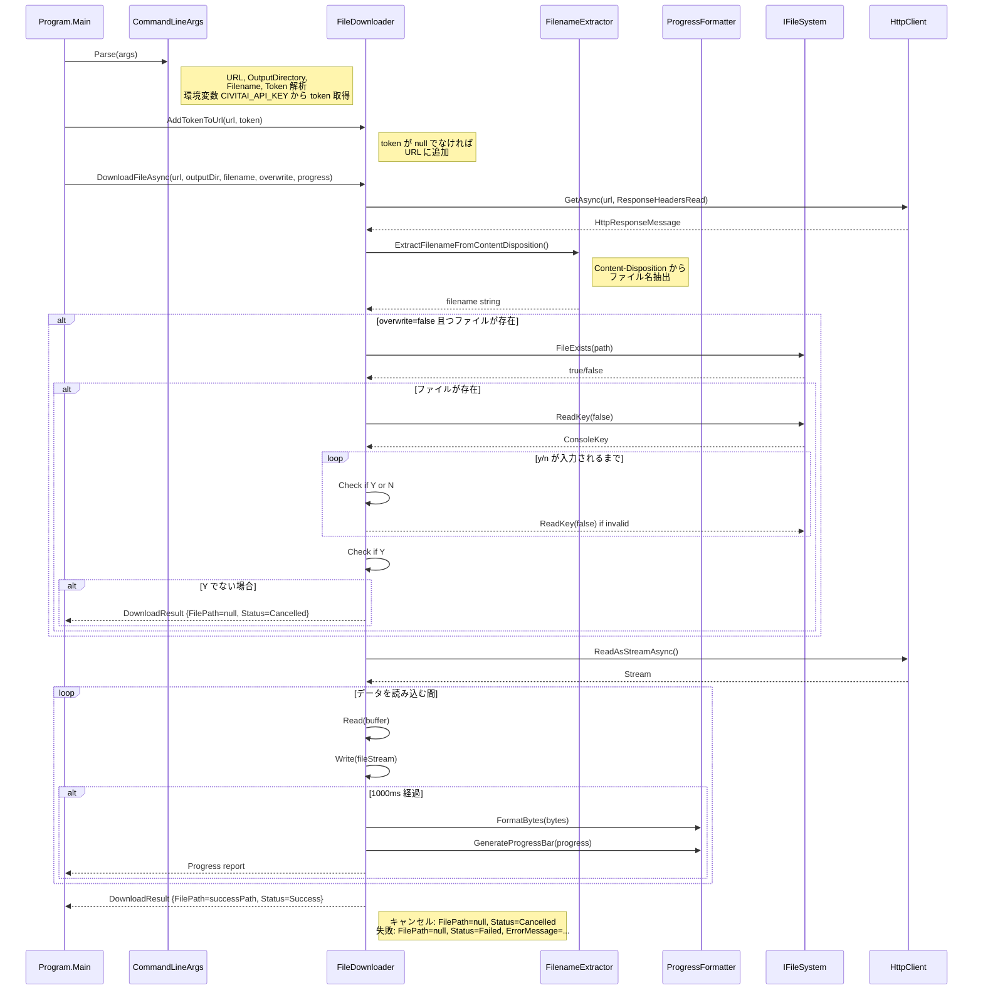
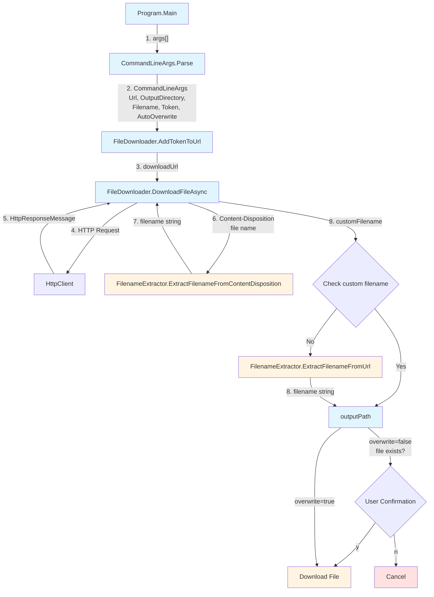
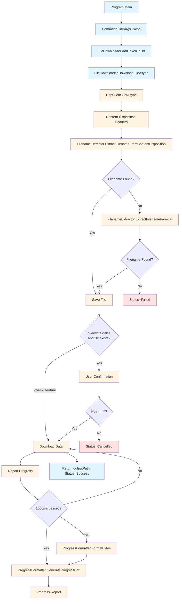

# データフロー図

## 全体データフロー



## クラス間のデータフロー



## メソッド呼び出し順序とデータフロー



## 進捗報告フロー

```mermaid
flowchart TD
    Start[Download Start] --> ReadBuffer[Read Buffer]
    ReadBuffer --> WriteStream[Write to FileStream]
    WriteStream --> UpdateRead[Update totalRead]
    UpdateRead --> CheckTime{Time >= 1000ms<br/>since last report?}
    
    CheckTime -->|Yes| Report[Report Progress<br/>progress, downloaded, total]
    CheckTime -->|No| NextRead[Next Buffer Read]
    
    Report --> NextRead
    NextRead --> CheckRead{Bytes Read > 0?}
    
    CheckRead -->|Yes| ReadBuffer
    CheckRead -->|No| FinalReport[Final Progress Report<br/>100%]
    
    FinalReport --> End[Download Complete]
    
    style Start fill:#e1f5ff
    style ReadBuffer fill:#fff4e1
    style WriteStream fill:#fff4e1
    style UpdateRead fill:#fff4e1
    style Report fill:#fff4e1
    style FinalReport fill:#fff4e1
    style End fill:#e1f5ff