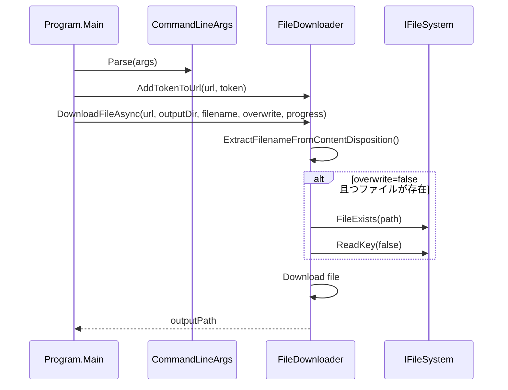

# メモリーバンク

## プロジェクト概要

| 項目 | 内容 |
|------|------|
| プロジェクト名 | Civitai Downloader |
| 言語 | C# (.NET 10.0) |
| フレームワーク | .NET 10.0 |
| テストフレームワーク | xunit |
| モックフレームワーク | Moq |
| プロジェクトディレクトリ | `q:\MyDocuments\Visual Studio 2022\Projects\CivitaiDownloader` |

## アーキテクチャ概要

### エントリーポイント
- `Program.Main` - CLI アプリケーションのエントリーポイント

### 主要なクラス
1. **Program** - エントリーポイント、CLI UI
2. **CommandLineArgs** - コマンドライン引数の解析と保持
3. **FileDownloader** - ファイルダウンロードの主要ロジック
4. **IFileSystem** - ファイルシステム操作の抽象化
5. **DefaultFileSystem** - IFileSystem の実装
6. **FileDownloader.DownloadResult** - ダウンロード結果を表すクラス（FilePath, Status, ErrorMessage プロパティ）
7. **FileDownloader.DownloadStatus** - ダウンロード状態を表す列挙型（Success, Cancelled, Failed）

### テスト用クラス
8. **DelayedStream** - ネットワーク遅延をシミュレートするカスタムストリーム（テスト用）
9. **DelayedHttpContent** - DelayedStream を返すカスタム HttpContent（テスト用）

### デザインパターン
- **Strategy パターン**: IFileSystem と DefaultFileSystem
- **Dependency Injection**: FileDownloader に HttpClient と IFileSystem を渡す
- **Progress Pattern**: 進捗報告に IProgress を使用

## データフロー



## クラスの責務

| クラス | 責務 |
|--------|------|
| Program | エントリーポイント、CLI UI、主要な制御フロー |
| CommandLineArgs | コマンドライン引数の解析と保持 |
| FileDownloader | ファイルダウンロードの主要ロジック |
| IFileSystem | ファイルシステム操作の抽象化 |
| DefaultFileSystem | IFileSystem の実装 |
| FileDownloader.DownloadResult | ダウンロード結果を表すクラス（FilePath, Status, ErrorMessage プロパティ） |
| FileDownloader.DownloadStatus | ダウンロード状態を表す列挙型（Success, Cancelled, Failed） |
| DelayedStream | ネットワーク遅延をシミュレートするカスタムストリーム（テスト用） |
| DelayedHttpContent | DelayedStream を返すカスタム HttpContent（テスト用） |

## テスト戦略

- **単体テスト**: FileDownloaderTests, CommandLineArgsTests, ProgramTests
- **統合テスト**: FileDownloaderIntegrationTests
- **モック**: Moq を使用して HttpClient と IFileSystem をモック

## よくある質問と回答

### Q: Civitai API からファイルをダウンロードする際、ファイル名が ID になってしまうのはなぜですか？
**A**: Civitai API はContent-Disposition ヘッダを返すため、FileDownloader はそれを解析して正しいファイル名を取得します。

### Q: 既存ファイルを上書きするにはどうすればいいですか？
**A**: `-y` オプションを指定すると、ユーザー確認なしで上書きされます。

### Q: Token を指定する方法は？
**A**: `--token <token>` オプションで指定するか、環境変数 `CIVITAI_API_KEY` を設定してください。

### Q: 進捗を確認するには？
**A**: ダウンロード中に進捗バーが表示されます。1000ms 間隔で更新されます。

### Q: テストを実行するには？
**A**: `dotnet test CivitaiDownloader.sln` を実行してください。

## ファイル構造

```
CivitaiDownloader/
├── CivitaiDownloader/
│   ├── Program.cs
│   ├── CommandLineArgs.cs
│   ├── FileDownloader.cs
│   ├── IFileSystem.cs
│   └── AssemblyInfo.cs
├── CivitaiDownloader.Tests/
│   ├── ProgramTests.cs
│   ├── CommandLineArgsTests.cs
│   ├── FileDownloaderTests.cs
│   ├── FileDownloaderIntegrationTests.cs
│   └── TestConstants.cs
├── docs/
│   ├── DATA_FLOW.md
│   ├── ARCHITECTURE.md
│   ├── MEMORY_BANK.md
│   └── PROJECT_PROGRESS.md
├── CivitaiDownloader.sln
└── README.md
```

## リンク

- **データフロー詳細**: [DATA_FLOW.md](./DATA_FLOW.md)
- **アーキテクチャ詳細**: [ARCHITECTURE.md](./ARCHITECTURE.md)
- **進捗管理**: [PROJECT_PROGRESS.md](./PROJECT_PROGRESS.md)